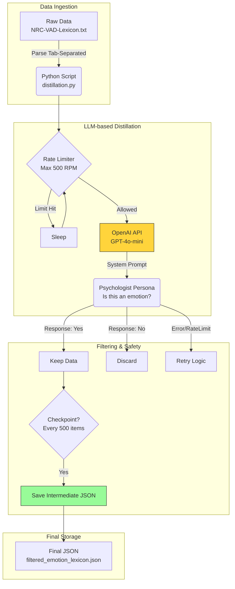

# Data Distillation Pipeline

> **"Refining raw data to power the emotional intelligence of AI characters."**

This module serves as the **Data Preprocessing & QA** stage for the parent project, **`delta_Me13_RE`**. It automates the cleaning of the VAD (Valence, Arousal, Dominance) lexicon to ensure high-quality emotion retrieval.

---

## Background (The "Why")

### 1. The Goal: Realistic AI Acting
For the `delta_Me13_RE` project, I wanted the AI character to perform realistic emotional acting, not just text generation.
* **Idea:** If an LLM can infer the "VAD Vector" of a situation based on context, I can map that vector back to a specific emotional keyword (e.g., *0.9, 0.1, 0.2* $\rightarrow$ *Serenity*) to guide the character's behavior.
* **Requirement:** To achieve this, I needed a search engine that converts **VAD Vectors $\leftrightarrow$ Emotion Strings**.

### 2. The Problem: Noisy Dataset
I selected the **NRC-VAD Lexicon** as the base dataset. However, I discovered a critical issue:
* The dataset contains over 20,000 words, but many are **semantically neutral** (e.g., *"Table"*, *"Walking"*, *"Industry"*).
* Searching for emotional vectors in this raw dataset often returned non-emotional objects, breaking the immersion of the AI character.

**Conclusion:** I needed to "distill" the dataset, keeping only words that genuinely describe emotions.

---

## Engineering Journey (The "How")

### 1. Automated Semantic Filtering
Manually classifying 20,000+ words was infeasible. Traditional rule-based filtering (Regex) couldn't capture semantic nuances.
* **Solution:** I treated this as a classification task for an LLM. I designed a system prompt assigning the AI a **"Psychologist Persona"** to judge whether a word represents an emotion.

### 2. Model Selection: Local vs. Cloud
* **Trial 1 (Local LLM):** Initially tried using **Qwen-14B** locally to save costs.
    * *Result:* Failed. The accuracy was insufficient for subtle emotional distinctions.
* **Trial 2 (OpenAI API):** Switched to **GPT-4o-mini**.
    * *Result:* Success. Provided high-fidelity classification suitable for the production database.

### 3. Infrastructure: Moving to the Cloud (GCP + Docker)
Processing the entire dataset required over 10 hours of continuous API calls.
* **Challenge:** Running this on a local PC was unstable (internet fluctuation, power issues).
* **Decision:** I deployed the pipeline on a **Google Cloud Platform (GCP)** instance using **Docker**.
    * *Learning Point:* This was a strategic choice to ensure process stability and to gain hands-on experience with cloud-native containerization workflows.
 

---

## Pipeline Architecture

The data processing workflow is designed to be autonomous and resilient.



## Technical Deep Dive

Here is how I engineered the script to handle real-world constraints.

### 1. The "Psychologist" Prompt Engineering
To ensure semantic accuracy, I established a **role-playing context** to reduce hallucination.

```python
# distillation.py
FILTER_SYSTEM_PROMPT = """You are an expert psychologist. 
Your task is to judge if a word describes an emotion.
You MUST respond with ONLY ONE WORD: "Yes" or "No".
"Happy", "Sad", "Pleased" = "Yes". ("Table", "Industry" = "No")"""
```

### 2. Handling API Instability
Running a long-job on the cloud means expecting API outages.
```python
try:
    answer = request_handler.sendMsg(messages)
except Exception as e:
    if "rate limit" in str(e).lower():
        print("Rate limit hit. Sleeping for 60s...")
        time.sleep(60)  # Exponential Backoff strategy
```
---

## Key Features

* **Smart Filtering:** Uses a prompt-engineered LLM judge (*"You are an expert psychologist..."*) to filter noise.
* **Fault Tolerance:** Handles `RateLimitError` and network jitters with exponential backoff.
* **Checkpoint System:** Auto-saves progress (`json` serialization) to resume operations in case of unexpected container termination.

## Usage

```bash
# 1. Place the raw NRC-VAD-Lexicon.txt in this folder
# 2. Build the Docker image
docker build -t vad-distiller .

# 3. Run the container
docker run -d -v $(pwd):/app vad-distiller
```

## Lessons Learned: Cloud Cost Management

> **"A coding error in the cloud can cost real money. I learned this the hard way."**

During the first deployment on GCP, I encountered a critical issue that resulted in a significant spike in API billing. This incident taught me the importance of **Idempotency** and **Container Lifecycle Management**.

### 1. The Incident (Post-Mortem)
* **The Mistake:** The initial script lacked a "termination check." I assumed the Docker container would just stop after finishing the loop.
* **The Context:** Due to a misconfiguration in the Docker restart policy and a lack of an exit condition check, the container **restarted automatically after completion**, reprocessing the same data and calling the OpenAI API infinitely for 10 hours.
* **The Result:** A massive number of redundant API calls were made, resulting in unexpectedly high costs.

### 2. The Solution: Idempotency Check
To prevent this from ever happening again, I implemented a strict **Fail-Safe mechanism** at the very beginning of the entry point.

```python
# distillation.py (Line 24-27)
if output_filepath.exists():
    print("✅ FINAL FILE FOUND: Distillation process is complete.")
    print("Stopping Docker container to save resources.")
    sys.exit(0)  # Immediate termination to prevent billing loop
```
* **Outcome**: Now, even if the container restarts or the script is re-triggered accidentally, it checks for the existence of the final dataset (filtered_emotion_lexicon.json) and terminates immediately without making a single API call.

