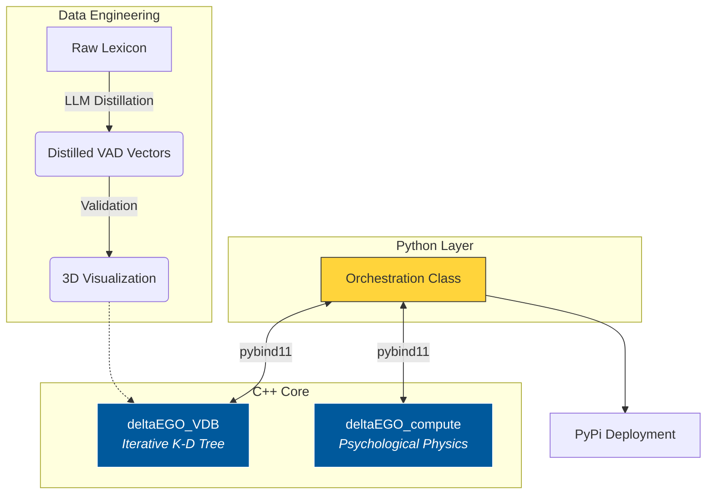

# DeltaEGO: High-Performance Real-time Emotion Engine 


> **"Bridging the gap between Psychological Theory and High-Performance Computing."**

**DeltaEGO** is a hybrid Emotion AI engine designed for real-time interactive characters. It combines a **custom C++ K-D Tree Vector Database** for millisecond-latency VAD (Valence, Arousal, Dominance) search with a **psychological computation module** that models stress, dopamine rewards, and emotional lability.

**Rapid Engineering:** The core C++ engine was architected and integrated in a **2-week sprint** to resolve critical latency bottlenecks in a larger AI orchestration system.

> ⚠️ **Disclaimer: Data & Copyright**
> * **Code Only:** This repository contains **source code only**. The original production repository includes the processed dataset but remains **private** to comply with the [NRC-VAD Lexicon](https://saifmohammad.com/WebPages/nrc-vad.html) terms of use and copyright restrictions.
> * **Bring Your Own Data:** To run this engine, you must obtain the raw NRC-VAD Lexicon license independently and run the provided distillation pipeline to generate your own vector dataset.

---

## Key Features

### 1. Custom Vector Database (C++ Core)
* **Iterative K-D Tree:** Implemented a heap-based iterative construction algorithm (using `std::vector` as a stack) to prevent stack overflow and optimize memory usage.
* **Fast Search:** Achieved **O(log N)** average search time using `std::nth_element` for median finding.

### 2. Real-time Psychological Modeling
* **Multithreading:** Utilized `std::async` to parallelize cumulative history analysis (O(N)) while calculating instant metrics (O(1)) concurrently.
* **Dynamic Metrics:** Computes "Emotional Lability" (Whiplash) and "Stress/Reward Ratios" in real-time.

### 3. Robust Data Pipeline
* **LLM Distillation:** Curated 20,000+ raw lexicon terms into high-quality vectors using an OpenAI-powered filtering pipeline deployed on **GCP (Docker)**.


## System Architecture



---

## Project Structure

Each module serves a specific stage in the engineering pipeline:

* **[`DistillData/`](./DistillData)** 
    * **Data Engineering:** Automated pipeline to filter raw VAD lexicon using LLMs. Handles API rate limits and fault tolerance.
* **[`Visualize_Data/`](./Visualize_Data)** 
    * **Verification:** 3D visualization tools (Plotly) to verify vector space density and clustering before deployment.
* **[`deltaEGO/`](./deltaEGO)** 
    * **Core Engine:** The C++ implementation of K-D Tree and Physics Engine, wrapped with `pybind11` for Python integration.

---

## 📊 Performance Benchmarks

| Operation | Method | Latency (ms) | Speedup |
| :--- | :--- | :--- | :--- |
| **Vector Search** | Pure Python | NaN | NaN |
| **Vector Search** | **DeltaEGO (C++)** | **NaN** | **NaN** |

> *Benchmarks run on local environment with dataset size N=NaN.*

---

## Development Methodology (AI-Assisted Engineering)

This project was built with an **AI-Assisted Engineering** approach to maximize velocity.
* **Architectural Brainstorming:** Leveraged LLMs to compare search algorithms (K-D Tree vs. HNSW) and design the "Iterative Stack" logic.
* **Code Implementation:** While AI accelerated the prototyping phase, **all core logic (Memory Management, Threading, pybind11 bindings)** was manually implemented, verified, and optimized to ensure production-level reliability.

---

## Installation

Since the dataset is excluded due to copyright, you must generate it first.
### 1. Prepare Data (Mandatory)
* Download the raw NRC-VAD Lexicon (.txt) from the official source.
* Place it in the DistillData/ folder.
* Run the distillation script to generate the vector JSON:
  ```bash
  cd DistillData
  python distillation.py
  ```
### 2. Install Python dependencies
```bash
pip install -r requirements.txt
```
### 3. Build C++ extensions (requires CMake)
```bash
cd deltaEGO
mkdir build && cd build
cmake ..
make
```
