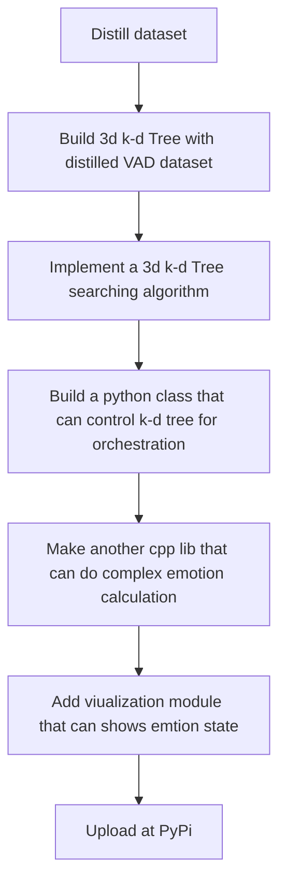

# from-VAD-vector-to-EGO
A c++ lib for getting string of emotion from vector. Made for Delta_Me13_RE and Fuli experiment repo

Inspired by Faiss

## Index

1. [Introduction](#Introduction)
2. [Plan](#Plan)
3. [Lesson](#Lesson)

---

## Introduction

Even though AI is getting more advanced day by day, AI dosen't have emotion. However, AI understands human's emotion. Even AI sometimes deeply understands our emotion more then human can do. Also, AI is a great actor too. From this, I got an idea. 

"If we give AI a very scripts with detailed emotion to act as how it says, AI may give us human-like output." 

This was a initial idea of my project, "Delta-me13" after I was impressed by a game called "Honkai Star Rail". Before I decided to start this project, I've made a foundation of "Delta-me13" and made a prototype with "TrongLongTran". However, the virtual character in prototype doesn't feel like a human. Thus to improve this, I choosed to make our project more advanced. And that's why I started another project, "Fuli_experiment". The objective of the project "Fuli_experiment" is make more advanced RAG algorithm and pipeline based on RAG 1.0. But, at the middle of the project, I realized few things. 

1. Even though we provide LLM enough memories and information, It will be a unhuman-like AI with quality information.

    The guide I've followed from now is "How to make personal AI agent". However, in general, AI agent just needs be "accurate" not human-like. So, the guide I've taken won't emulate human's emtion.

2. In the real human's memory, it is consisted with data and emtion.

    When we recall our memories, each memories contains emotion and has a connection with other memories just like node.

Despite Fuli class will handle the memories, it cannot calculate emotion of each memories. So, I chose to make a new custom pip lib for emotion. For calculating emotion, I'll use VAD emotion vector and distilled dataset "The NRC Valence, Arousal, and Dominance (NRC-VAD) Lexicon by Saif M. Mohammad". The route of this project will be like this:

Since Python is slow for complex math calculations and searching data, I decided to make a Python module with C++. 

For this project, these will be the objectives:

1. Build a custom 3d vector database and save the VAD vector dataset
2. Like Faiss, the target time complexity is O(log n)
3. Since this module will run with a local LLM, FastAPI server, and Front End server, target a constant call stack space (using an iterative approach) to prevent stack overflow.
4. Successfully implement this module in the Delta_Me13_RE project with pybind11

From this project, I might learn:

1. Deeper understanding of Vector Database
2. How to compare vector data with Euclidean distance or Cosine Similarity
3. How to use the Dataset
4. Learn how to use pybind11
5. Time and Space complexity optimization
6. Learn the k-d tree data structure
7. Use Iteration and std::stack to prevent stack overflow with recursion

## Plan

### Idea: k-d Tree Implementation (O(log n))
To meet the project objectives, implement a k-d tree for spatial partitioning.

Goals:
1. Design and implement a `KDNode` structure.
2. Implement a **BuildTree** function (using median finding) for $O(N \log N)$ construction.
3. Implement an **Iterative Search** function (using `std::stack`) to achieve $O(\log N)$ average search time while preventing stack overflow.
4. Refactor the C++ library to use the k-d tree.
