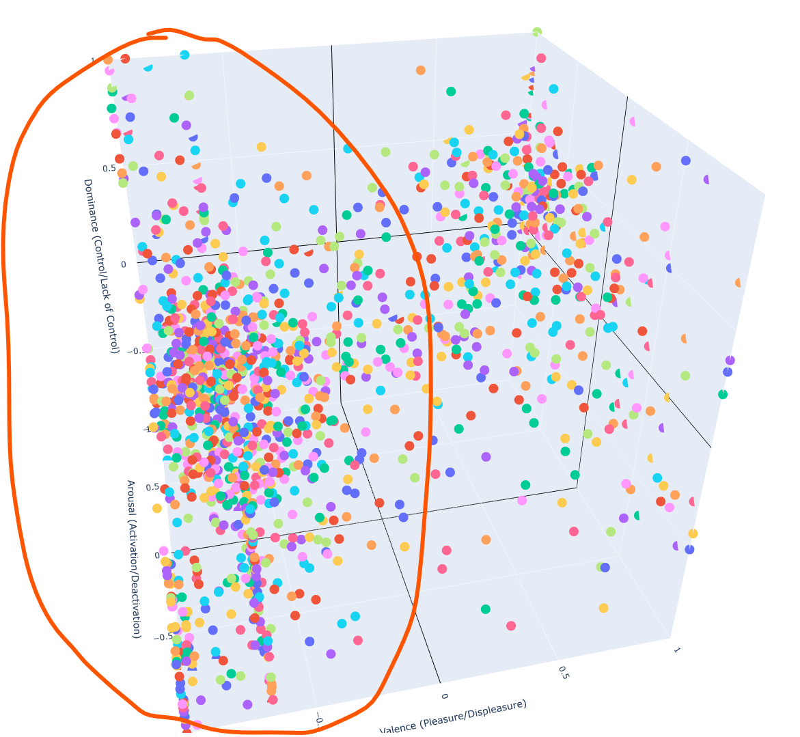
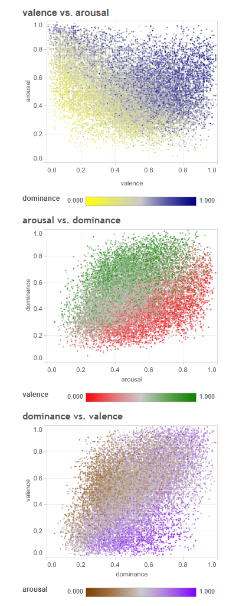

# 📊 Data Visualization & Verification

> **"Trust, but verify. Visualizing the topology of emotion."**

Before deploying the distilled vectors into the K-D Tree search engine, I conducted an **Exploratory Data Analysis (EDA)** to verify the spatial distribution of the data. This step was crucial to ensure that the LLM-based distillation didn't introduce artificial bias or destroy the semantic structure of the original lexicon.

---

## Objective

1.  **Topological Verification:** Ensure that 3D vectors map to meaningful clusters (e.g., "Anger" and "Rage" should be close neighbors).
2.  **Distribution Check:** Validate that the distilled dataset follows the statistical distribution of the original NRC-VAD Lexicon.

---

## The Verification Process (Data Agglomeration)

### 1. Observation: "The Dense Cluster"
Upon generating the initial 3D scatter plot using `Plotly`, I observed a significant **agglomeration (clumping)** of data points in specific quadrants, rather than a uniform distribution.

*(Please insert your 3D image here - image.jpg)*
> **Figure 1:** 3D Scatter plot showing dense clustering of emotion vectors.

### 2. Hypothesis & Investigation
My initial concern was that the LLM distillation might have biased the data, effectively "collapsing" diverse emotions into a generic average. This would have made the K-D Tree search inefficient (imbalanced tree) and the AI's acting repetitive.

### 3. Validation against Ground Truth
To verify this, I compared my 3D plot against the 2D projection distributions documented in the original **NRC-VAD Lexicon paper**.


...


> **Figure 2:** Reference distribution from NRC-VAD Lexicon (Source: [Saif M. Mohammad](https://saifmohammad.com/WebPages/nrc-vad.html)).

* **Finding:** As seen in the reference plot above, the lexicon naturally exhibits dense clustering.
* **Conclusion:** The agglomeration in my 3D plot matches the ground truth topology. The data is valid.

---

## Code Overview

The visualization logic is implemented in `visualize.py` using **Plotly Express** for interactive 3D rendering.

```python
# Key Visualization Logic
fig = px.scatter_3d(
    df,
    x='valence',
    y='arousal',
    z='dominance',
    color='term',  # Color-coded by term for inspection
    title='VAD 3D Vector Space'
)

# Enforcing a Cube Aspect Ratio for accurate distance perception
fig.update_layout(scene=dict(aspectmode='cube'))
```
* **Why Aspect Mode 'Cube'?**
    * In vector search, Euclidean distance is key. If the plot is stretched, visual distance becomes misleading. Forcing a cube ratio allows for accurate visual debugging of nearest neighbors.
 
---
## Usage
```bash
# 1. Ensure the 'Final.json' exists in ../Distilled_data/
# 2. Run the script
python visualize.py

# 3. It will open a browser window with the interactive 3D plot.
```

