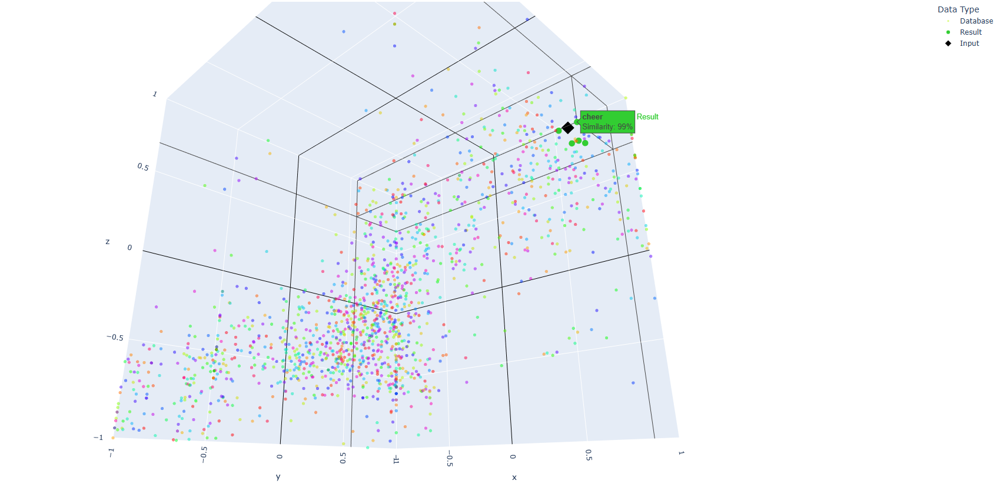

## 📚 VAD Vector Database (custom KD-Tree)

deltaEGO uses a custom **KD-Tree–based vector database** to store and query emotions
in VAD (Valence–Arousal–Dominance) space.  
Each entry corresponds to one emotion term with its VAD coordinates.

Internally this is implemented in C++ as `KDTree` (in `VAD_customVDB.*`). :contentReference[oaicite:0]{index=0}

---

### Data format & loading

The VDB is populated from a JSON file of the following shape:

```jsonc
[
  {
    "term": "cheer",
    "valence": 0.8,
    "arousal": 0.6,
    "dominance": 0.5
  },
  ...
]
```
The loader:
1. parses the JSON array.
2. For each element creates an ```Emotion```:
    * ```term``` – emotion label (e.g. ```"cheer"```)
    * ```point``` – 3D coordinates ```(x = valence, y = arousal, z = dominance)```
3. Stores them in ```Emotions``` (a contiguous ```std::vector<Emotion>```).
4. Builds a KD-Tree over the indices of ```Emotions```, using an iterative algorithm.
5. Computes per-axis standard deviation (```AxisScale```) for later whitened Gaussian similarity (see below).
---
## Iterative KD-Tree build

Instead of a recursive build (which risks stack overflows and reallocations), the KD-Tree is built iteratively using an explicit stack of frames:
```cpp
struct Frame {
    int l, r;       // half-open range [l, r) in the index buffer
    int depth;      // determines split axis: depth % 3
    int parent;     // parent node index (-1 for root)
    bool is_left;   // whether this node is the left child of its parent
};
```
Algorithm sketch:
1. Start with frame ```{l=0, r=N, depth=0, parent=-1}```.
2. For each frame, choose split axis = ```depth % 3```.
3. Use ```std::nth_element``` on the index buffer to place the median at position ```median```.
4. Create a ```Node``` with:
    * ```idx``` = ```P_buffer[median]``` (index into ```Emotions```)
    * ```axis``` = split axis
    * ```left / right``` = initially ```-1```
5. Link this node to its parent (or mark it as ```root``` if ```parent``` = ```-1```).
6. Push right and left subranges onto the stack with ```depth + 1```.

This gives a compact KD-Tree where:
  * nodes are stored in a single std::vector<Node>,
  * each node points into the emotion array instead of duplicating data.
---
## Search API: VAD_search_near_k(...)
The main query entrypoint is:
```cpp
std::string KDTree::VAD_search_near_k(
    double V,    // valence
    double A,    // arousal
    double D,    // dominance
    int    k,    // how many neighbors?
    double d,    // search radius / distance threshold
    double SIGMA,
    std::string opt
);
```
Output is a JSON string containing:

  * the query VAD,
  * the search mode/options,
  * a ranked list of hits with:
    * ```emotion``` (term),
    * ```VAD``` of that emotion,
    * squared distance,
    * similarity percentage,
    * human-readable expression (e.g. ```"quite cheer"```).
    
If the query is exactly ```(0,0,0)```, the function short-circuits to a neutral result

---
## Search options: visit strategy & similarity metric

The ```opt``` string encodes two things:
  * visit strategy (how to traverse / prune the tree)
  * similarity metric (how to compute “closeness” in %)

The format is:
```cpp
"<visit>~<sim> <flag>"
```
Example (default in the Python wrapper):
```cpp
"knn~l2 -S"
```
**1) Visit strategy (visit_key)**
Parsed from the left part (before ~):

  * ```"knn"``` – standard k-nearest neighbors, no radius constraint
  * ```"knn_d"``` – k-NN within radius d; nodes beyond d are skipped early
  * anything else falls back to ```"knn"``` 

This is implemented via ```get_search_func(...)```, which returns a ```std::function``` used in the iterative traversal:
```cpp
std::function<void(
    const Point3D&, // query
    int,            // node index
    int,            // k
    double,         // d
    MaxHeap&        // heap of hits
)> KDTree::get_search_func(std::string& option);
```
**2) Similarity metric (sim_key)**
Parsed from the right part (after ~):

  * ```"d"``` – relative similarity based on radius d
  * ```"l2"``` – absolute L2 distance
  * ```"cos"``` – cosine similarity
  * ```"gauss"``` – Gaussian RBF on plain L2
  * ```"gauss_w"``` – whitened Gaussian, using per-axis std dev in VAD space
  * ```"none"``` – treated as L2 by default 

All of these return an integer percentage (0–100), which is later mapped to text like ```"mild"```, ```"moderate"```, ```"intense"```, ```"absolute"``` etc. (This doesn't works proprerly now)

**3) Flag (```flag```)**

The ```flag``` (e.g. ```-S```, ```-B```, ```-E```, ```-D```) controls how much detail goes into the JSON: whether to include squared distances, similarity text, etc. By default, ```-S``` is used in the Python wrapper, which includes:
  * rank
  * emotion term
  * VAD triple
  * distance
  * similarity %
  * a simplified expression such as ```"quite cheer"```.
---
## Example result
When the query is:


Visualization:
* Input: 

    
* Output(visualized)

    
